# 🧠 Brain Tumor MRI Classification

**Live app → [brain-tumor-mri-2k8i.onrender.com](https://brain-tumor-mri-2k8i.onrender.com/)**

A deep-learning system that classifies brain MRI scans as **glioma, meningioma, pituitary tumor or no tumor**. It compares a custom CNN with two transfer-learning models and serves the best one in an interactive web app. The app also explains every model layer by layer.

| Final model (leakage-free test set, 158 images) | Accuracy | Macro-F1 | ROC-AUC | Tumors missed |
| --- | --- | --- | --- | --- |
| **MobileNetV2, fine-tuned (deployed)** | **90.5%** | **0.892** | **0.995** | **0.0%** |
| EfficientNetB0, fine-tuned | 86.1% | 0.826 | 0.990 | 0.8% |
| Custom CNN, tuned | 82.3% | 0.811 | 0.964 | 4.8% |

> Educational project — **not a medical device**. Predictions must not be used for diagnosis.

> The app runs on Render's free plan. After 15 minutes without visitors the server sleeps, so the first visit can take **30–60 s** while it wakes. The page shows a "waking the model server" status, and all charts load straight away.

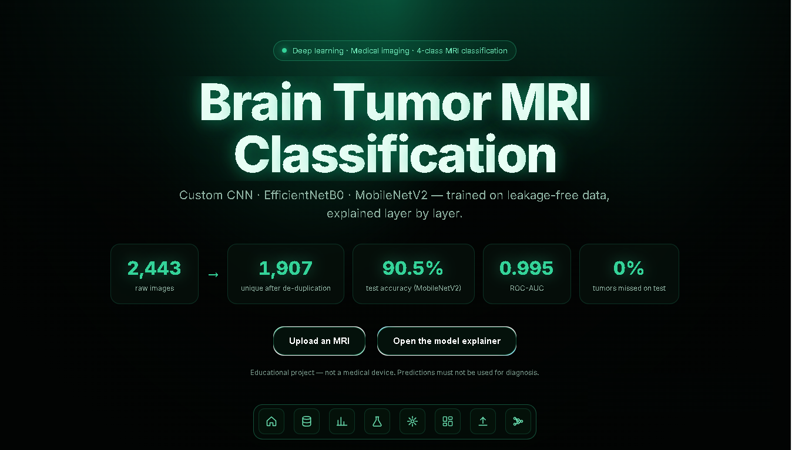

---

## Highlights

- **Leakage-free data.** Perceptual-hash de-duplication (256-bit pHash under all 8 flips and rotations, ≥ 95% similarity) found 760 near-duplicate pairs in the 2,443-image dataset, 236 of them leaking across train, validation and test. Removing them left 1,907 unique images, so every score is measured on unseen scans.
- **Three models, one protocol.**
  - A custom CNN, built from scratch and tuned with a grid search and 3-fold cross-validation.
  - EfficientNetB0 and MobileNetV2, ImageNet-pretrained, trained frozen and then fine-tuned.

  All three share the same augmentation, class weights, callbacks and metrics.
- **Statistically backed selection.** Selection uses validation macro-F1, with the tumor miss rate and latency as tie-breakers. McNemar's test confirms MobileNetV2 makes significantly fewer errors than the custom CNN (p = 0.021). Bootstrap confidence intervals show how certain each number is.
- **Explainable.** Occlusion maps show the model looks at brain tissue, not background. The in-app explainer shows real activations and real trained weights for every layer of all three models.
- **Lightweight deployment.** The server runs the models with LiteRT, without TensorFlow, and peaks at about 365 MB of memory. Its preprocessing is verified pixel-identical to training, and the live API reproduces the notebook's 143 / 158 test predictions exactly.

## What's in the app

| Section | Contents |
| --- | --- |
| **Dataset & cleaning** | Duplicate pairs by split, removals by class, similarity distribution, duplicate groups, example leak pairs, preprocessing and augmentation |
| **Exploratory data analysis** | All 15 notebook charts (univariate → bivariate → multivariate), interactive, each with its insight and business impact |
| **Hypothesis testing** | H1 brightness and H2 framing (Kruskal–Wallis with post-hoc tests); H3 model errors (McNemar) |
| **Model results** | Per model: training histories, confusion matrices, metric charts, improvement tables, grid search, cross-validation, fine-tuning grids |
| **Every metric, every model** | 8 dashboards: metric heatmap, grouped metrics, per-class precision/recall/F1, confusion matrices, ROC and PR curves, clinical error rates, calibration, learning curves. Also confidence intervals, efficiency, final selection and occlusion maps |
| **Upload an MRI** | Live MobileNetV2 prediction with confidence, all four probabilities and input-quality warnings |
| **Model explainer** | 3 model buttons; the exact 224 × 224 input matrix with a zoom lens; a schematic of every layer (shape, parameters, configuration); and the network itself, with real activation values and real weights. Includes a size selector and a full-screen pop-out |

## Screenshots

### Dataset & leakage-free cleaning
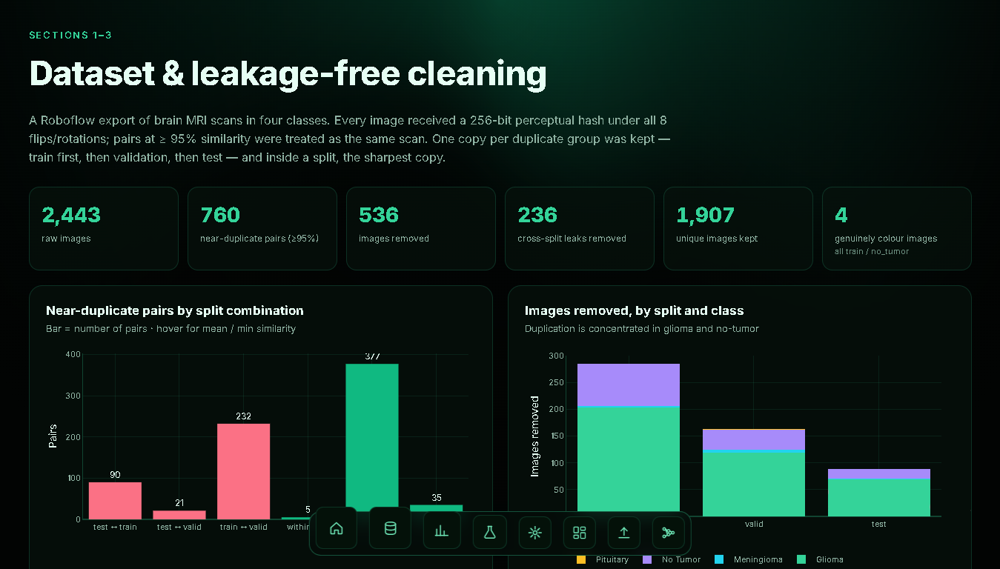
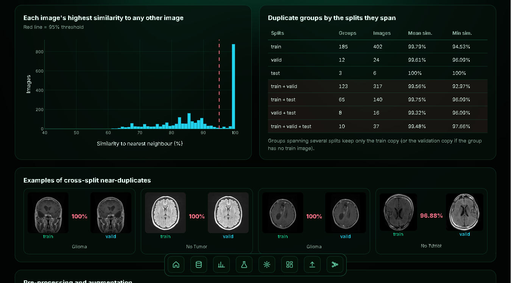

### Exploratory data analysis
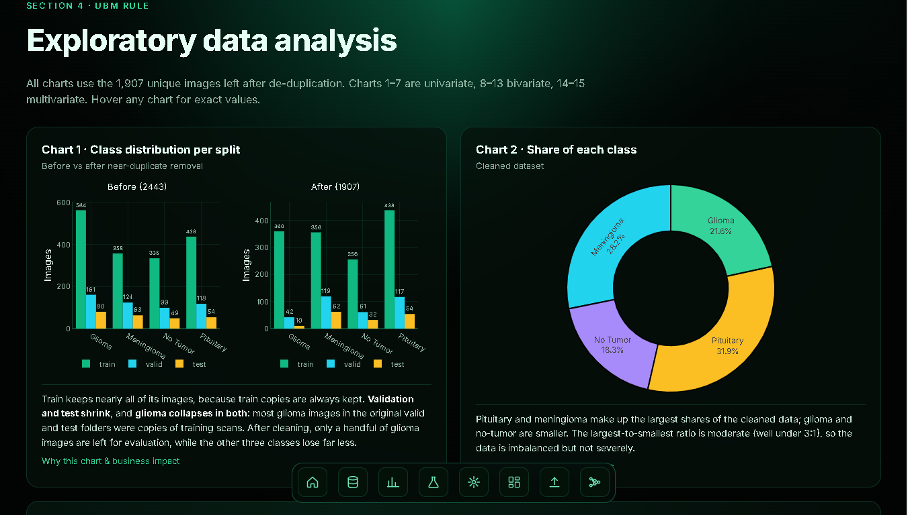
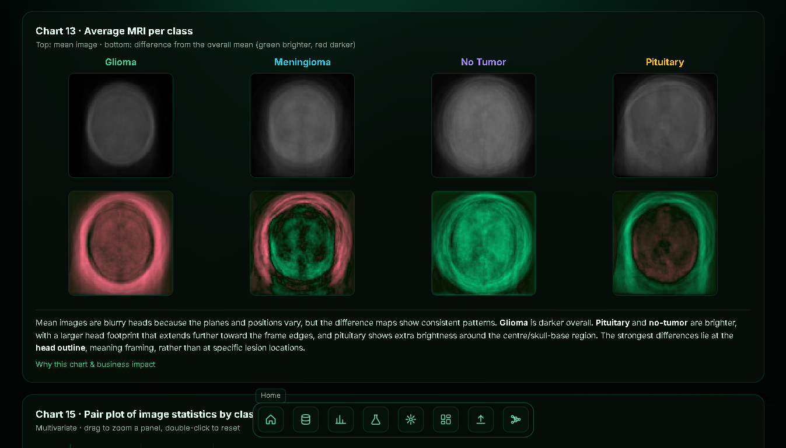

### Hypothesis testing
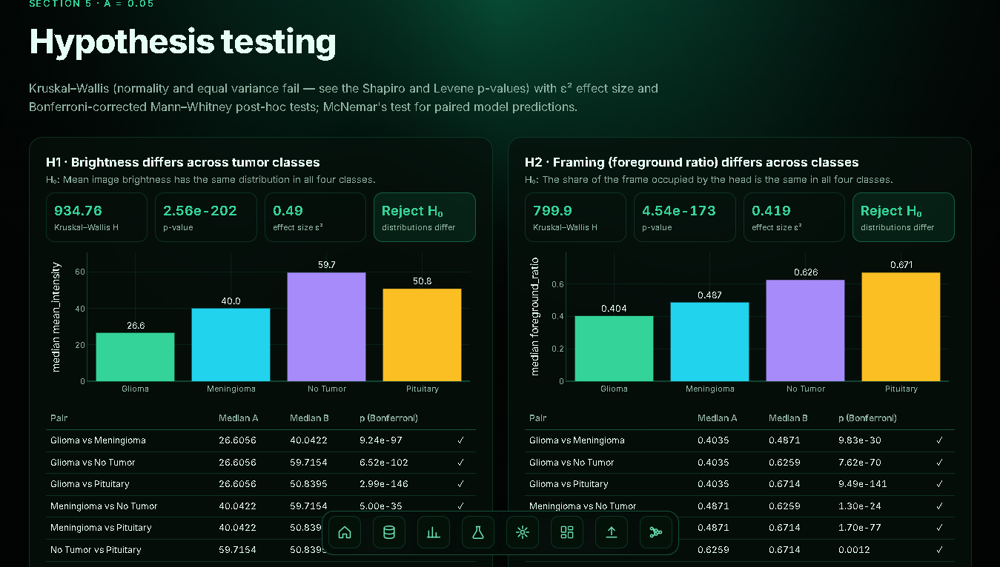

### Model results and comparison
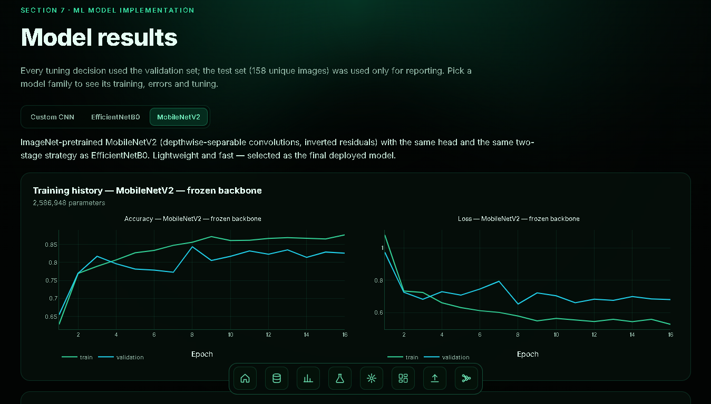
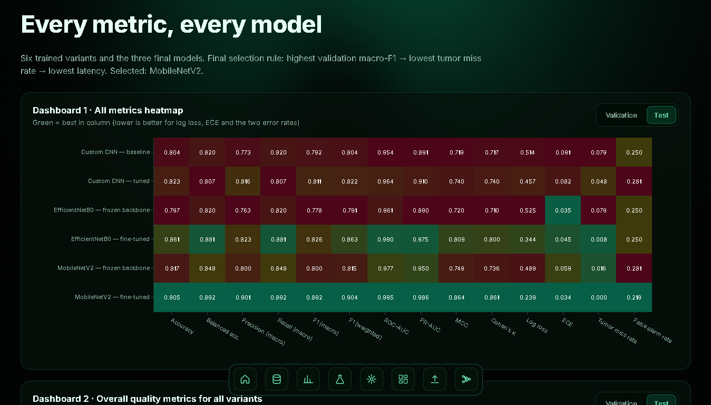
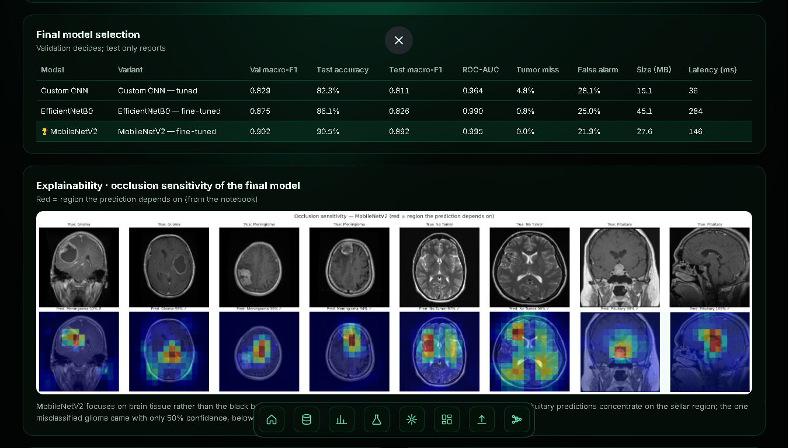

### Live prediction
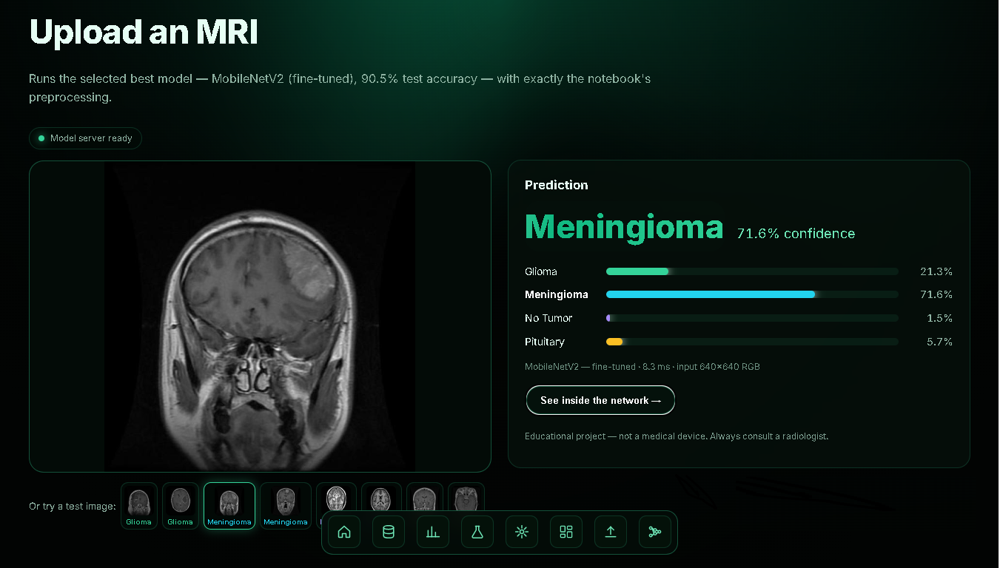

### Model explainer
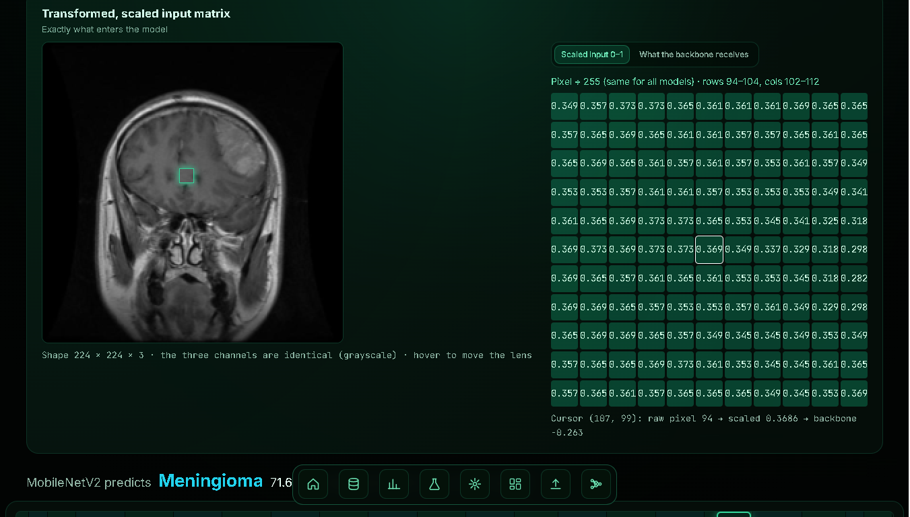
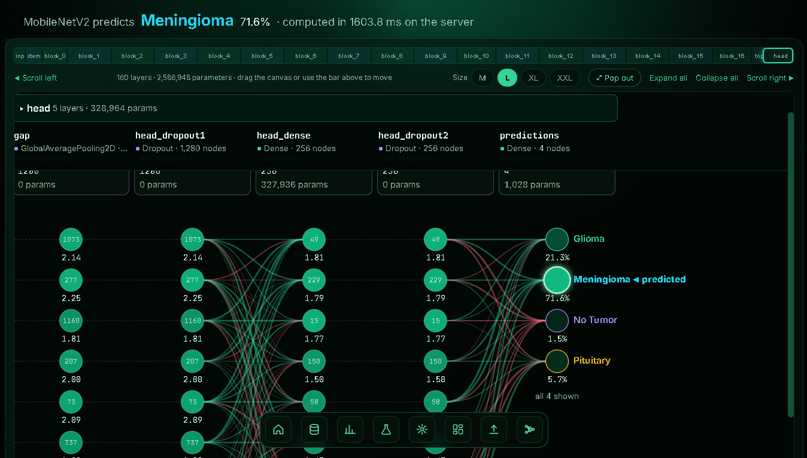

---

## Architecture

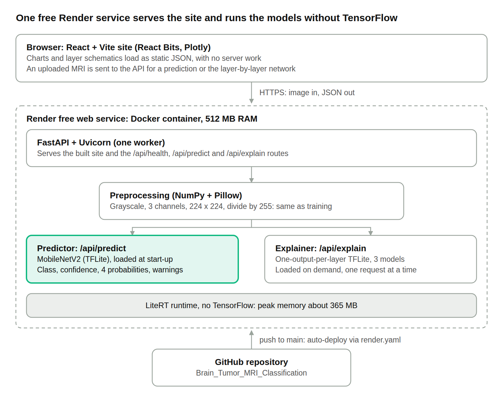

```
Browser (React + Vite, React Bits components, Plotly charts)
   │  static JSON (charts, layer schematics) — served with the site, no server work
   │  POST /api/predict, /api/explain     — image upload
   ▼
FastAPI (one process) — serves the built site + API
   ├─ preprocessing.py  PIL grayscale → 3 channels → 224×224 antialiased resize (NumPy) → ÷255
   ├─ Predictor         MobileNetV2 (TFLite) — loaded at start-up
   └─ Explainer         one-output-per-layer TFLite model of the selected network, loaded on demand
```

| Endpoint | Purpose |
| --- | --- |
| `GET /api/health` | Status, deployed model and class names |
| `POST /api/predict` | MobileNetV2 prediction: class, confidence, 4 probabilities, warnings |
| `POST /api/explain?model=custom_cnn\|efficientnetb0\|mobilenetv2&k=4–16` | Every layer's top-k node values, feature-map thumbnails and real-weight lines |

API documentation: [`/api/docs`](https://brain-tumor-mri-2k8i.onrender.com/api/docs)

**How the explainer works**

- **Nodes:** for each layer, the server shows the k most-activated channels or units out of the layer's total. A node's value is that channel's mean after the layer; for dense layers it is the exact unit value. Convolution, batch normalization and activation each keep their own values.
- **Lines** carry real trained weights:
  - dense layers: the exact weight;
  - convolutions: the 3 × 3 kernel summed per input → output channel;
  - depthwise convolutions: one value per channel;
  - batch normalization: its per-channel scale γ/√(σ² + ε).
- **Verified:** all 36 / 159 / 243 layers match the original Keras models, with a relative difference below 1e-4.

## Repository layout

```
Dockerfile, render.yaml       one-service deployment (Render free plan, Docker runtime)
backend/
  app/main.py                 FastAPI app (API + static site)
  app/inference.py            LiteRT prediction + explainer network builder
  app/preprocessing.py        TensorFlow-free preprocessing + upload checks
  assets/                     *.tflite models, layer graphs, line-weight files, config.json
  requirements.txt
frontend/
  src/sections/               Hero, Dataset, EDA, Hypotheses, Models, Dashboard, Predict
  src/explainer/              Explainer, NetworkView (schematic + network), InputMatrix
  src/reactbits/              React Bits components (see licences)
  public/data/                chart data exported from the notebook run
  public/img/                 thumbnails, sample test images, notebook figures
tools/                        offline export scripts that produced public/data and backend/assets
docs/                         README screenshots and architecture diagram
```

## Run locally

```bash
# backend (Python 3.10–3.12)
cd backend
python -m venv .venv && source .venv/bin/activate      # Windows: .venv\Scripts\activate
pip install -r requirements.txt
uvicorn app.main:app --reload --port 8000

# frontend (Node 20+) — in a second terminal
cd frontend
npm install
npm run dev            # http://localhost:5173 (proxies /api to :8000)
```

For a production-like run, build the site first (`npm run build`); FastAPI then serves `frontend/dist` at http://localhost:8000.

With Docker:

```bash
docker build -t brain-mri .
docker run -p 10000:10000 brain-mri      # http://localhost:10000
```

## Deploy on Render

1. Fork or push this repository to GitHub.
2. In Render, choose **New → Blueprint**, select the repository, and apply the `brain-tumor-mri` service from `render.yaml` (Docker runtime, free plan, health check `/api/health`).
3. The first build takes about 5–10 minutes. Every later push to `main` redeploys automatically.

Keep `--workers 1`, which is already set, so memory stays under the free plan's 512 MB.

## Regenerating the data and model files

`tools/export_eda.py` and `tools/export_models.py` rebuild `frontend/public/data` and `backend/assets` from the notebook run. They need TensorFlow; the server does not.

Set `EXPORT_ROOT` to a folder containing:
- the raw dataset (`project_data/`);
- the de-duplicated dataset (`clean/` with `clean_metadata.csv`);
- the notebook's `reports/`, `metrics/`, `history/`, checkpoints and `deployment_config.json`.

`export_models.py` stops with an error if any variant's recomputed validation or test accuracy differs from the notebook.

## Tech stack

| Layer | Tools |
| --- | --- |
| Modelling | Python, TensorFlow / Keras 3, scikit-learn, SciPy, statsmodels, NumPy, pandas |
| Serving | FastAPI, Uvicorn, LiteRT (`ai-edge-litert`), NumPy, Pillow |
| Frontend | React 19, Vite, Plotly, React Bits (Aurora, SplitText, BlurText, ShinyText, CountUp, SpotlightCard, StarBorder, GlareHover, Dock), GSAP, Motion, OGL |
| Hosting | Docker on Render, source on GitHub |

## Licences

- **React Bits components** (`frontend/src/reactbits/`): MIT + Commons Clause (see `LICENSE-reactbits.md`). Fine for personal, portfolio and course use; the components themselves may not be sold.
- **Dataset:** Roboflow export under CC BY 4.0.
